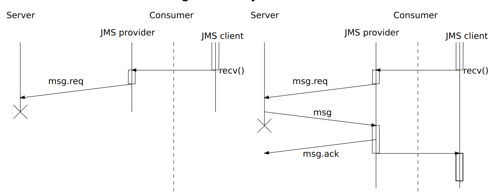

<h1> Large Scale Distributed Systems -- 2nd Class (Theory) </h1>

> 20th September 2023 -- FEUP

<h1> Table of Contents </h1>

- [Java Messaging Services (Continuation)](#java-messaging-services-continuation)
  - [JMS Queues: Communication Semantics](#jms-queues-communication-semantics)
  - [JMS Queues: Implementation of PERSISTENT Delivery](#jms-queues-implementation-of-persistent-delivery)
  - [JMS Queues: Once-and-Only Guarantees](#jms-queues-once-and-only-guarantees)
  - [JMS Queues Session-based Transactions](#jms-queues-session-based-transactions)
- [Replication and Consistency Models](#replication-and-consistency-models)
  - [Data Replication](#data-replication)

## Java Messaging Services (Continuation)

### JMS Queues: Communication Semantics

- **Reliability** depends on the *delivey mode*, which may be set per message, e.g. in the send() call
  - **PERSISTENT** ensures *once-and-only-once* semantics, i.e, the failure (?crash?) of the JMS provider must not cause a message to be lost or to be delivered 2x
  - **NON-PERSISTENT** ensures at-most-once semantics
    - Message needs not survive a JMS server crash
    - But JMS is expected to tolerate common network failures~

### JMS Queues: Implementation of PERSISTENT Delivery

- Implementing PERSISTENT delivery is not trivial
  - A distributed system is characterized by partial failures

- Let’s assume for simplicity’s sake, that there is just one server
between producer and consumer

  

- The channel between a client and the JMS server can loose messages
  - E.g. the message producer sends the message, but
communication problems cause the message to be lost and . . .
    - Producer must receive confirmation from JMS server
  - A similar scenario may happen in the channel between the
JMS server and the message consumer
    - The consumer must acknowledge the reception, before the JMS
server can dispose of the message

- Even if the provider uses TCP for communication with the server

- **Consumer acknowledgment** behavior is set per *session*.
  - Consumer acknowledgment is used to ensure that a message
is delivered to one consumer

- There are 3 (+1, as we’ll explain below) modes:
- **AUTO_ACKNOWLEDGE** the JMS session, i.e. the provider, automatically acknowledges upon a successful return from either receive() or the reception callback

  

- **DUPS_OK_ACKNOWLEDGE** the JMS session lazily acknowledges the
delivery of messages.
  - The provider may deliver a message, without sending an ACK to the server
- **CLIENT_ACKNOWLEDGE** it is up to the client to acknowledge the delivery of messages.
  - The provider does not send ACK, the client does it whenever it sees fit, by calling the acknowledge method of Message
    - Acknowledgment of a message, implicitly acknowledges previously received messages

- **Issue:** upon recovery of the server there may be uncertainty to wrt message delivery. Before the failure, some messages:
  - May have not been sent
  - Or their acknowledgment may have been lost

  

- **Upon failure of the consumer**, the provider may be uncertain about message delivery. Some messages:
  - May have not been delivered
  - Or their acknowledgment may have been lost

  

  
  

  - Also possible (with AUTO_ACKNOWLEDGE): JMS serverreceives ACK, but consumer crashes before processing message

- **Solution**: the provider resends messages whose delivery it is uncertain about with:
  - *JMSRedelivered* **header field** set;
  - *JMSXDeliveryCount* **header property** with the appropriate value
    - It should be incremented every time the provider may have delivered the message
    - For a redelivered message its value must be larger or equal to 2.
- **Consumer** learn about messages that it may have delivered before the failure
  - The application may have more information than the JMS provider to deal with this uncertainty

### JMS Queues: Once-and-Only Guarantees

- JMS’ once-and-only-once delivery is not exactly once
  - If a message may be a duplicate, the consumer is notified.
- Apache’s Kafka claims to support exactly once delivery
  - Neha Narkhede, [Exactly-Once Semantics Are Possible: Here’s How Kafka Does It](https://www.confluent.io/blog/exactly-once-semantics-are-possible-heres-how-apache-kafka-does-it/)
- But Kafka has the advantage that its topics are logs (implemented on non-volatile storage) whose records (messages/events) may persist for a long time (configurable)
  - A consumer can read a record, even if it subscribes to a topic long after that record was added to the topic
  - Each consumer has an offset pointing to the next message in a topic (more or less), and it can reset it to another value.
- Exactly once delivery on Kafka is built on top of: 
  - **Idempotent** send operations with no duplication on one partition
    - A Kafka topic may have several partitions, each of which is a log
  - **Transactions** to write atomically to different partitions
    - Writing happens not only on a send, but also on a receive (as it modifies the partition’s offset)

### JMS Queues Session-based Transactions

- All messages sent/received within a session execute in the scope
of a transaction
- To terminate the current transaction (and start the next one), a
JMS client must call
  - **commit()** so that all messages sent are added to the destination queue(s), and to acknowledge the delivery of all messages received.
  - **rollback()** to cancel the sending of all messages sent in the scope of the current transaction, as well as the delivery of all messages received (what does this mean?)
- Session-based transactions are the fourth session mode. I.e., it
(SESSION_TRANSACTED) cannot be used with the other session
modes, e.g. **AUTO_ACKNOWLEDGE**

## Replication and Consistency Models

### Data Replication

- Replicate data at many nodes
- **Performance**: Local reads
- **Reliability**: no data-loss unless data is lost in all replicas
- **Availability**: data available unless all replicas fail or become unreachable
- **Scalability**: balance load across nodes for reads

- Upon an update:
  - Push data to all replicas
  - Challange: ensure **data consistency**
 
