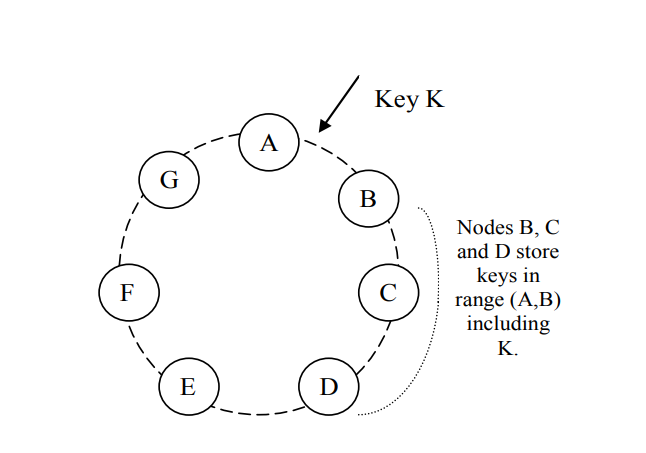

<h1> Dynamo: Amazon's Highly Available Key-value Store </h1>

> [http://www.allthingsdistributed.com/files/amazon-dynamo-sosp2007.pdf](http://www.allthingsdistributed.com/files/amazon-dynamo-sosp2007.pdf)

- [Abstract](#abstract)
- [1. Introduction](#1-introduction)
- [2. Background](#2-background)
  - [2.1 System Assumptions and Requirements](#21-system-assumptions-and-requirements)
  - [2.2 Service Level Agreements (SLAs)](#22-service-level-agreements-slas)
  - [2.3 Design Considerations](#23-design-considerations)
- [3. Related Work](#3-related-work)
  - [3.1 Peer-to-Peer (P2P) Systems](#31-peer-to-peer-p2p-systems)
  - [3.2 Distributed File Systems and Databases](#32-distributed-file-systems-and-databases)
  - [3.3 Discussion](#33-discussion)
- [4. System Architecture](#4-system-architecture)
  - [4.1 System Interface](#41-system-interface)
  - [4.2 Partitioning Algorithm](#42-partitioning-algorithm)
  - [4.3 Replication](#43-replication)
  - [4.4 Data Versioning](#44-data-versioning)
  - [4.5 Execution of get() and put() Operations](#45-execution-of-get-and-put-operations)
  - [4.6 Handling Failures: Hinted Handoff](#46-handling-failures-hinted-handoff)
  - [4.7 Handling Permanent Failures: Replica Synchronization](#47-handling-permanent-failures-replica-synchronization)
  - [4.8 Membership and Failure Detection](#48-membership-and-failure-detection)
    - [4.8.1 Ring Membership](#481-ring-membership)
    - [4.8.2 External Discovery](#482-external-discovery)
    - [4.8.3 Failure Detection](#483-failure-detection)
  - [4.9 Adding and Removing Storage Nodes](#49-adding-and-removing-storage-nodes)
- [5. Implementation](#5-implementation)
- [6. Experiences and Lessons Learned](#6-experiences-and-lessons-learned)
  - [6.1 Balancing Performance and Durability](#61-balancing-performance-and-durability)
  - [6.2 Ensuring Uniform Load Distribution](#62-ensuring-uniform-load-distribution)
  - [6.3 Divergent Versions: When and How Many?](#63-divergent-versions-when-and-how-many)
  - [6.4 Client-driven or server-driven coordination?](#64-client-driven-or-server-driven-coordination)
  - [6.5 Balancing background vs foreground tasks](#65-balancing-background-vs-foreground-tasks)
  - [6.6 Discussion](#66-discussion)
- [7. Conclusions](#7-conclusions)

## Abstract

One of the biggest challenges faced by Amazon is reliability at a large sacle. The Amazon platform is build on top of tens of thousands of servres and network components, in different areas of the work.

At this scale, it is not uncommom for small or large components to fail The following text file summarizes the design and implementation of Dynamo, a highly available key-value storage system that some of Amazon's core services use to provide an always-on experience.

**Dynamo sacrifices consistency under certain failure scenarios**.

It makes use of object versioning:

> (Object) Versioning allows multiple revisions of a single object to exist.

It also uses an "application-assisted conflict resolution mechanism" in situations where versioning is not sufficient.

## 1. Introduction

> Reliability and scalability of a system are dependant on how its application state is managed.

Amazon utilizes Dynamo to oversee the operational state of services that demand high availability and necessitate precise control over the trade-offs between availability, consistency, cost-efficiency, and performance.

Dynamo amalgamates established methodologies to achieve scalability and availability, specifically through data partitioning and replication. It employs consistent hashing for both data partitioning and replication, while ensuring data consistency through object versioning.

To maintain consistency across diverse replicas, Dynamo utilizes a quorum-like approach and a decentralized replica synchronization protocol. It incorporates a distributed failure detection and membership protocol based on gossip mechanisms.

Dynamo is designed as a fully decentralized system, requiring minimal manual administration. The addition or removal of storage nodes from Dynamo can be executed seamlessly, without necessitating manual partitioning or data redistribution.

## 2. Background

Relational databases are often ill-suited for numerous common use cases at Amazon. Many of these services primarily involve straightforward data storage and retrieval based on a primary key, eliminating the need for the complex relational queries that traditional RDBMSs are specifically designed to handle. Utilizing relational databases in such scenarios can be excessive, demanding costly hardware and skilled personnel for operation.

Furthermore, the replication techniques typically employed by RDBMSs tend to prioritize data consistency over availability, which may not align with the requirements of certain Amazon services.

Scaling out RDBMSs and applying load-balancing techniques to distribute workloads across multiple machines is often a challenging task.

In contrast, Dynamo offers a simple key/value interface, ensuring high availability and defining a clear consistency window. It excels in its scalability, providing an efficient approach to handling increased workloads.

Each service employing Dynamo operates its own instances, allowing for tailored system adjustments to meet the unique demands of the service.

### 2.1 System Assumptions and Requirements

**Query Model** - simple read/write ops. to a data item uniquely identified by a key.

How is state store? - as binary objects, i.e. blobs, identified by unique keys.

No operations span multiple data items, so the need for a relational schema is eliminated.

Dynamo targets applications that need to store relatively small objects (typically less than 1 MB).

**ACID Properties** - set of properties that guarantee that database transactions are processed reliably.
Experience at Amazon has shown that data stores that provide ACID guarantees tend to have poor availability. Dynamo targets applications that operate trade sacrifice consistency if it results in high availability.

Dynamo does NOT provide isolation guarantees and allows for only single-key updates.

**Efficiency** - 99.9th percentile of the distribution in regards to latency is a requirement for Amazon services. Since state acess plays such crucial role in the performance of a service, Dynamo must be able to scale out to meet the performance requirements regardless of the workload.

Services must configure their Dynamo instances to meet their performance requirements. The tradeofs are in performance, cost efficiency, and durability guarantees.

**Other Assumptions** - Dynamo is used only by Amazon services and its operational environment is assumed to be non-hostile.

### 2.2 Service Level Agreements (SLAs)

Clients and services engage in formal SLA contracts, specifying system-related characteristics such as the client's expected request rate distribution and the expected service latency under various conditions. For example, a simple SLA might guarantee a response within 300ms for 99.9% of requests at a peak client load of 500 requests per second.

Amazon's approach to SLAs is unique in that it is expressed and measured at the 99.9th percentile of the distribution, rather than relying on average or median metrics. This ensures a consistent high-quality experience for all customers, including those with more extensive usage.

Many papers in the industry report on averages, but Amazon's engineering efforts concentrate on controlling performance at the 99.9th percentile. The choice of the 99.9th percentile is based on a cost-benefit analysis that demonstrated significant cost increases to improve performance even further. Amazon's practical experiences have shown that this approach provides a superior overall customer experience compared to systems that focus on mean or median performance.

The chapter highlights the role of storage systems in establishing an SLA, especially when business logic is lightweight. In this context, state management becomes a crucial component of an SLA. The design of Dynamo, as discussed in the paper, prioritizes giving services control over their system properties, allowing them to make trade-offs between functionality, performance, and cost-effectiveness.

### 2.3 Design Considerations

Data replication algorithms used in comercial systems usually perform synchronous replication, which guarantees consistency, but at the cost of the availability of the data under certain failure scenarios.

For example, the data is made unavailable until the system is certain that the data is 100% consistent across all replicas. This is not acceptable for Amazon services, which require high availability and low latency.

**Strong consistency and high availability are at odds with each other**.

If the system is prone to network/server failures, availability can be improved by relaxing consistency requirements. The challenge is that this can lead to data divergence, which can be difficult to resolve.
And two new difficulties arise:

- When should the system fix the data divergence?
- Who should resolve the data divergence?

Dynamo is designed to be an eventually consistent data store. The updates will reach all replicas, eventually.

It is important to decide when to resolve the data divergence. Should this be done during reads or writes?

- Many traditional systems resolve data divergence during writes. In such systems, writes may fail if the data store cannot reach all replicas.
- Dynamo prefers an 'always writeable' approach. Amazon cannot afford to reject customer updates, i.e, adding/removing items from the shopping cart. The complexity is thus pushed to the read ops.

But who should resolve the data divergence? The client or the server?

- If conflict resolution is done by the data store (server), choices are limited. Only policies such as 'last write wins' can be implemented.
- The applicaction (client) can implement more sophisticated conflict resolution policies since it is aware of the data semantics.

Other key design considerations:

| Design Consideration | Description |
| -------------------- | ----------- |
| **Incremental scalability** | Dynamo must be able to scale out one storage host at a time, with minimal impact on both operators and the system itself. |
| **Symmetry** | Every node in Dynamo should have the same set of responsibilities as its peers; there should be no distinguished node or nodes that take special roles or extra set of responsibilities. |
| **Decentralization** | An extension of symmetry, Dynamo should be decentralized and should minimize the need for manual administration. It should be able to automatically partition, distribute, and recover data in the face of node failures. |
| **Heterogeneity** | Dynamo should be able to exploit heterogeneity in the infrastructure it runs on. It should be able to use all the available resources in the infrastructure, and should scale well under heterogeneous loads. |

## 3. Related Work

Following sectiosn discuss related work in the areas of peer-to-peer systems, distributed file systems, and distributed databases.

### 3.1 Peer-to-Peer (P2P) Systems

1st Gen P2P systems -> Freenet, Gnutella : Unstructured P2P systems.

2nd Gen P2P systems -> Chord, Pastry : Structured P2P systems, i.e, use routing mechanisms to ensure queries
are answered within a small number of hops. To reduce latency introduced by multi-hop routing, some P2P systems employ O(1) routing where each peer maintains a small routing table so it can route requests to the appropriate peer within a constant number of hops.

Some storage systems like Oceanstore and PAST are buld on top of these routing overlays.

**Oceanstore** : global, transactional, persistent storage service that supports serialized updates on widely replicated data. To allow for concurrent updates while avoid locking problems, it uses an update model based on conflict resolution. Conflict resolution was introuced to reduce the number of transaction that abort. Conflict resolution is done by processing a series of updates, choosing a total order amongst them and them applying them atomically in that order.

On the other hand, **PAST** provides an abstraction layer on top of Pastry.

### 3.2 Distributed File Systems and Databases

<!--  WRITE LATER, NOT THAT IMPORTANT RN -->

### 3.3 Discussion

Dynamo differs from the aforementioned systems in the following ways:

- Dynamo's main target are applications that need an 'always writeable' data store where, even under failures, updates never fail. This is CRUCIAL for many Amazon services.
- Secondly, Dynamo is build for an environment within a single administrative domain, i.e, Amazon's data centers, where ALL nodes are assumed to be trusted.
- Application that use Dynamo, do NOT require technical support for hierarchical namespaces, or complex relational schemas. Dynamo is a simple key/value store.
- Dynamo is build for latency sensitive apps that require, at least, 99.9% of read/write ops to be served within a few hundred milliseconds. To meet these, the developers had to ditch routing request through many nodes (like Pastry and Chord do) instead, each nodes maintains enough routing info locally to route a request to the appropriate node directly. They call it 'zero-hop DHT routing'. DHT stands for Distributed Hash Table.

> Read more about zero-hop DHT here: <http://datasys.cs.iit.edu/reports/2012_Qual-IIT_ZHT.pdf>

## 4. System Architecture

The architecture is complex, as expected of a production setting. In addiction to the data persistent component, the following scalable and robust components are also present:

- load balancing
- membership and failure detection
- failure recovery
- replica synchronization
- overload handling
- state transfer
- concurrency and job scheduling
- request marshalling
- request routing
- system monitoring and alarming
- configuration management

The paper only discusses [partitioning](#42-partitioning-algorithm), [replication](#43-replication), [membership and failure detection](#48-membership-and-failure-detection), [failure handling](#46-handling-failures-hinted-handoff) and [scaling](#49-adding-and-removing-storage-nodes).

**Summary of Techniques Used by Dynamo**: The following table summarizes the techniques used by Dynamo to achieve its design goals.

| Problem | Technique | Advantage |
| :-------: | :---------: | :---------: |
| **Partitioning** | Consistent Hashing | Incremental Scalability |
| **High-Availability for writes** | Vector Clocks with reconciliation during reads | Version size is decoupled from update rates |
| **Handling temporary failures** | Sloppy Quorum and hinted handoff | Provides high-availability and durability guarantees when some of the replicas are not available |
| **Recovering from permanent failures** | Anti-entropy using Merkle trees | Synchronizes divergent replicas in the background |
| **Membership and failure detection** | Gossip-based membership protocol | Preserves symmetry and avoids having a centralized registry for storing membership and node liveness information |

### 4.1 System Interface

Dynamo stores objects associated with a key through a simple interface, it exposes two operations:

- `get(key)`: Given a key, locates the object replicas associated with the key in the storage systems and returns a single object, or a list of objects with conflicting versions along with a context.
- `put(key, context, object)`: Determines where the replicas of the object should be placed based on the associated key and writes replicas to disk. `context` encodes metadata about the object that is opaque to the caller and includes info such as the version of the object. This context is shared along with the object so that the systems verifies the validity of the context object supplied by the caller.

Both key and object supplied by the caller are treated by Dynamo as an opaque array of bytes.
It applies a MD5 hash on the key to generate a 128-bit ID, which determines storage nodes that are responsible for serving the key.

> By opaque, they mean that Dynamo does not have any knowledge about the structure of the key or the object. It doesnt try to interpret or manipulate the content, and just stores and retrieves it as an opaque array of bytes.

### 4.2 Partitioning Algorithm

> To remember: One of the key design requirements is that it must scale incrementally, i.e, adding a new node to the system should be easy and should not require any manual partitioning or redistribution of data.

The Dynamo's partitioning scheme relies on consistent hashing to distribute the load across multiple storage hosts.

The output range of an hash function in consistent hashing is treated as a fixed circular space or "ring".
The idea is that the largest hash value wraps around to the smallest hash value, forming a continuous loop.

> Imagine this "ring" as a circle where hash values are evenly distributed along the circumference. Each node in the system is also assigned a position on this ring, determined by hashing its identifier or address. Data is then associated with a position on the ring based on its hash value. When you want to find which node should be responsible for a particular piece of data, you hash the data's key, find its position on the ring, and locate the nearest node in a clockwise direction. This ensures that data distribution is fairly even and allows for efficient load balancing.

This way, each node is responsible for an area in the ring between it and its predecessor node. The main advantage is that the removal of a node only affects its imediate neighbors and the other nodes remain unaffected.

Some challanges arise when using the basic consistent hashing algorithm:

- the random position assignment of nodes in the ring leads to non-uniform data and load distribution.
- the basic algorithm is oblivous to heterogenity in the performance of nodes.
  - to adress this, dynamo uses a variant of consistent hashing: instead of mapping a node to a single point in the circle, each node gets assigned to multiple points in the ring. Thus, dynamos uses "virtual nodes", that look like normal nodes in the system, but each node can be responsible for more than one virtual node.

Using virtual nodes brings three main advantages:

- if a node becomes unavailable, the load handled by this node is evenly dispersed across the remaining available nodes.
- when a node becomes available again, or a new node is added to the system, the newly available node accepts a roughly equivalent amount of load from each of the other available nodes.
- the number of virtual nodes that a node is responsible for can be decided based on its capacity, addressing the heterogeneity issue.

### 4.3 Replication

To ensure high availability and durability, Dynamo employs data replication. Each data item is replicated on multiple hosts, with the number of replicas, denoted as N, being a configurable parameter for each instance. Here's a summary of the key points:

**Replication Configuration**: Each key, denoted as "k," is assigned to a coordinator node. The coordinator is responsible for replicating data items falling within its designated range. Replication is carried out by storing each key locally at the coordinator and additionally replicating it at the N-1 clockwise successor nodes in the ring.

**Responsibility Zones**: This replication scheme divides the ring into regions of responsibility for each node. Each node is responsible for the region of the ring between itself and its Nth predecessor. For example, in the figure below, node B replicates key k at nodes C and D, along with its local storage. Node D stores keys within the ranges (A, B], (B, C], and (C, D].

  

  
<i>Figure 1: Responsability Zones</i>

**Preference List**: The list of nodes responsible for storing a particular key is referred to as the "preference list." The system is designed to enable every node to determine the nodes that should be on this list for any given key. This facilitates efficient data retrieval.

**Handling Node Failures**: To account for node failures and ensure availability, the preference list contains more than N nodes. This redundancy helps maintain data accessibility even in the presence of node failures.

**Virtual Nodes**: With the use of virtual nodes, it's possible that the first N successor positions for a key may be owned by fewer than N distinct physical nodes. In other words, a single physical node may hold multiple positions in the preference list. This design choice allows for more flexible load distribution and resilience to node failures.

The key takeaway is that Dynamo's replication strategy is designed for high availability, durability, and efficient data retrieval. It utilizes preference lists to ensure that data is stored redundantly and accessible even in the event of node failures, while virtual nodes enhance flexibility and load balancing.

### 4.4 Data Versioning

As previously stated, Dynamo provides eventual consistentcy. Updates are propagated to replicas, asynchronously.

> I.E. `A put()` call may return to the caller before the update has reached all replicas. Which can lead to subsequent `get()` ops. returning an object without the latest updates.

Usually, under normal conditions, the period of time for update propagation is bounded. However, under failure conditions, updates may not arrive for an extended period of time.

**Amazon Shopping Cart Example** : This application tolerates such inconsistencies. The app requires that the `Add to Cart` operation is never ignored or rejected. If a user makes changes to the cart, the change is meaningful and should be preserved, even if the state of the cart is unavailable and the changes were made in an older version of the cart. However, it shouln't supersede the "unavailable" changes.

Divergent versions are reconciled later. But how?

Multiple versions of an object can coexist in the system simultaneously. Typically, new versions replace the previous ones, and the system itself can identify the authoritative version, a process known as syntactic reconciliation.

> **Syntactic reconciliation**, in the context of data management and version control, is a mechanism that determines the authoritative or preferred version of data based on syntactic or structural criteria. It involves comparing different versions of the same data and selecting one as the "winner" based on predefined rules or criteria.

However, there are times were version branching might occur due to the presence of failures combined with concurrent updates. The system cannot reconcile these versions automatically, and the client must perform the reconciliation in order to collapse multiple versions into a single one (semantic reconciliation).

> Example of a collapse operation: “merging” different versions of a customer’s shopping cart. Using this reconciliation mechanism, an “add to cart” operation is never lost. However, deleted items can resurface.

Dynamo uses **vector clocks** to capture causality between different versions of the same object.
A vector clock is essentially a list of (node, counter) pairs. One vector clock per object version.

Determine whether two versions are on parallel branches or have a causal ordering --> compare the two vector clocks.

- If the first object's vector clock is "less than equal" to all nodes on the second object's vector clock, then the first is an ancestor of the second and can be discarded.
- Othewise the changes are considered to be in conflict and require conciliation.

To update an object in Dynamo, the client must first specify which version is being updated. Clients do this by passing the context obtained in a previous read op. The context contains the vector clock info.

### 4.5 Execution of get() and put() Operations

Any storage node is eligible to receive client `get` and `put` operations for a key. The operations are invoked using Amazon's infrastructure-specific request processing framework over HTTP.

Two strategies that a client can use to select a node:

- route its request through a generic load balancer that'll choose a node based on load information.
- use a partition-aware client library that routes requests directly to the appopriate *coordinator node.*

The first approach frees the client of having to link any code specific to Dynamo in its app, while hte second approach can achieve lower latency because it is potentially skipping a forwarding step.

A node that handles a read or write request is called a *coordinator node*. Usually, this is the first among the top N nodes in the preference list. If requests are received through a load balancer, requests to acess a key may be routed to any random node in the ring. In this case, the receiving node will NOT coordinate the request if it's not in the top N nodes of the requested key's preference list. Instead, it'll forward the request to the first among the top N nodes in the preference list.

If all nodes are healthy, the top N nodes in a key's preference list will be accessed. Otherwise, nodes ranked lower in the preference list will instead be accessed.

In order to main consistency across all replicas:

- Dynamo uses a protocol similar to quorum systems. The protocol has two configurable parameters: R and W.
  - R is the minimum number of nodes that must participate in a successful read operation.
  - W is the minimum number of nodes that must participate in a successful write operation.
- R + W > N configuration yields a quorum-like system. Latency is dictated by the slowest of the R (or W) replicas. For this reason, R and W are typically configured to be less than N, to provide better latency.

When a coordinator nodes receives a `put()` request for a key, it generates the vector clock for the new version and writes it locally. Then, it sends the new version (alongside the new vector clock) to the N highest-rated reachable nodes. If at least `W-1` nodes respond, then a write is considered successful.

Similarly, for a `get()` request, the coordinator requests all existing versions of data for that key from the N highest-rated reachable in the key's preference list. It then waits for `R` responses before returing the result to the caller. If multiple versions of data are gathered, it'll return all versions it deems to be casually unrelated. The divergent versions are then reconciled and then the reconciled version superseeding current versions is written back.

### 4.6 Handling Failures: Hinted Handoff

Had Dynamo's developers chosen to use a quorom-like system, the system would have been unavailable in the event of server failures and network partitions and would have reduced durability even under simple failure scenarios.

To remedy this, Dynamo uses a "sloppy quorom": all reads (and writes) are performed on the first N healthy nodes in the preference list, which may NOT always be the first N nodes encoutered while traversing the consistent hashing ring.

> Observe the figure below. Imagine N=3. If A dies during a write operation, then a replica that would have lived on A will be sent to node D. This replica will have a **hint** in its metadata that suggest which node was the intended recepient. D will keep this replica in a separate local store that'll scanned periodically. When D detects A has recoverd, it'll attempt to deliver the replica to A. If succesfull, D may delete the replica from its local store.

  

Using hinted handoff, the process above described, Dynamo ensures that the read and write
operations are not failed due to temporary node or network
failures.

If an app needs a really high level of availability, it can W to be 1, which ensures that the write will be accepted as long as at least one node has durably written the key to its local storage. In pratice, most Amazon services in production have W set higher to achieve a higher durability guarantee.

Even in an event of datacenter failure (natural disaster, network failure, cooling issues, wtv), Dynamo allows Amazon to handle entire data center failures withough data outage. This is achieved by placing replicas in multiple data centers. In essance, the preference list of a key is constructed such that the storage nodes are spread across multiple data centers.

### 4.7 Handling Permanent Failures: Replica Synchronization

Hinted takeoff will work in situations where system membership churn is low and node failures are transient.

- Low membership churn: the membership of the system changes slowly over time, i.e, nodes are not frequently leaving or entering the system.
- Transient node failures: nodes that fail will eventually recover.

There are scenarios where hinted replicas become unavailable before they can be delivered to the intended recipient. To handle this, Dynamo implements an **anti-entropy** (**replica synchronization**) protocol based to keep replicas synchronized.

The protocol is based on Merkle trees, which are hash trees where leaves are hashes of the values of the individual keys. Parent nodes higher in the tree are hashes of their respecive children.

Main advantage: each branch of the tree can be checked independently without requiring nodes to download the entire tree or the entire data set. It reduces the amount of data that needs to be transferred while checking for inconsistencies among replicas.

> Imagine two trees. If the hash values of the root nodes are the same, then the values of the leaf nodes are equal, and no synchronization is required. If not, it implies different replica values. In such cases, nodes may enchange hash values of the children and the process repeats until the end of the tree is reached.

Dynamo uses Merkle trees as follows:

- Each node maintains a tree for each key range (set of keys covered by a virtual node) it hosts.
- Two nodes exchange the root of the tree corresponding to the key ranges they host in common.
  - Subsequently the nodes determine if they have any differences and perform the appropriate synchronization action.

The main disadvantage of this approach is that many key ranges will change when a node joins or leaves the system which requires tree recalculation. This issues is address in [Section 6.2](#62-ensuring-uniform-load-distribution).

### 4.8 Membership and Failure Detection

The following sections discuss the membership and failure detection protocols used by Dynamo.

#### 4.8.1 Ring Membership

In Amazon environment, most node failures are transient. It was deemed appropriate to use an explicit mechanism to initiate the addition or removal of a node from the ring. This is done manually using command-line tools or browser by an administrator.

The nodes that serves this request will write the membership to persistent store. Membership changes form a history. To propagate membership changes, a gossip-based protocol is used and it'll maintain an eventually consistent view of membership. Each node contacts a peer chosen at random every second and these two nodes will reconcile their persisted membership change histories.

When a node starts for the first time, it'll choose its set of tokens (virtual nodes in consistent hashing space) and maps nodes to theire respective token sets. The mapping is persisted on disk and, at first, contains only the local node and token set. Mappings stores at different Dyanamo nodes are reconciled using the same comuniaction exchange that reconciled membership changes.

Therefore, partitoning and placement info also propagates through the gossip protocol.

#### 4.8.2 External Discovery

The mechanism above described could result in a temporary logically partioned Dynamo ring.

> Admin contacts node A to join A to the ring, then contacts node B to join B to the ring. However, A and B are not aware of each other. This results in a temporary logically partitioned Dynamo ring.

To prevent this, some nodes play the role of seeds. Seeds are nodes that are discovered using an external mechanism and are known to all nodes. All nodes will eventually reconcile their membership with a seed, and thus logical partitions are highly unlikely.

Seeds are either obtained from static configuration or from a configuration service and act as fully functional nodes in the Dynamo ring.

#### 4.8.3 Failure Detection

Failure detection is used to avoid attemps at communicating with unreachable nodes during `put` or `get` operations and when transferring partitions and hinted replicas.

A local notion of failure is sufficient:

> Node A may consider node B to be failed if it does not respond to A's messages, even if B is still responding to C's requests.

- A steady rate of client request that generate intercommunication between nodes in the ring will allow A to quickly detect B's failure. Node A will then use alternate nodes in the preference list to perform the operation.
- In the absence of client request that drive traffic between nodes, neither node really needs to know about the other's failure.

Decentralized failure detection protocols also use a gossip-style protocol that allows each node in the system to be informed about a node's departure (or arrival) to the system.

Early Dynamo designs used a protocol like that. Later, it was determined that the explicit node join and leave methods obviates the need for a global view of failure state.

> Nodes are notified of permanent node addictions and removals by the explicit node join and leave methods and, temporary failures are detected by individual nodes, when they fail to communicate with other nodes (when forwarding requests or transferring data).

### 4.9 Adding and Removing Storage Nodes

Let's consider the same figure and that a node, let's say X. is added to the system.

  

X was assigned a random number of tokens scattered across the ring. For every key range that is assigned to node X, there might be a number of nodes that are currently in charge of that key range.

Let's say X has been added to the ring, in-between node A and B.
When joining the ring, it'll be in charge of storing keys in the following ranges: (F-G], (G-A] and (A-X].

Thus, nodes B, C and D will no longer have to store the keys in the respective ranges. These nodes will offer to, and, upon confirmation, tranfer the appropriate keys to node X. When a node is removed, the process is reversed.

Experience has shown that this approach distributes the load of key distribution uniformly across storage nodes. Furthermore, by adding the confirmation round between src and dest, it is made sure that the dest node does not receive any duplicate transfers for a key range.

## 5. Implementation

Now let's actually talk about the implementation of Dynamo. Theory will only take us so far.

In Dynamo, each storage node has three main software components:

- request coordination
- membership and failure detection
- local persistence engine

**Local persistence component**: allows for different storage engines to be plugged in. The ones used by Dynamo are:

- Berkeley Database (BDB) transactional data store
- BDB Java Edition
- MySQL
- In-memory buffer with persistent backing store

But why did they chose to design a pluggable persistence component? - Choose the best suited storage engine for the application's access patterns.

- BDB handles objects in the tens of kilobytes order, whereas MySQL handles objects with larger sizes.

Majority of Dynamo's production instances use BDB Transactional Data Store.

**Request coordination component**: All communication are implemented using JAVA NIO channels.

- Coordinator nodes execute read and write operation on behalf of the clients.
- Each client request creates a state machine on the node that receives the request.
  - This state machine contains all logic for identifying the nodes responsible for a key, sending requests, waiting for responses, potentially doing retries, processing replies and packaging the final response to the client.

Each state machine handles **exactly one** client request.

Typlical state machine steps for a `get()` operation:

- send read requests to nodes
- wait for minumum number of responses (R) to return
- if too few responses were received, fail the request
- otherwise gather all data versions and decide those to be returned to the client
- if versioning is enabled, perform syntactic reconciliation and generate opaque write context that contains the vector clock that subsumes all remaining versions
- after response has been return to the caller, the state machine will wait for a configurable amount of time for the remaining responses to arrive
  - If stale responses arrive, the coordinator will update those nodes with the latest version of the data.

As noted earlier, write requests are coordinated by one of the top N nodes in the preference list. Although it is desirable always to have the first node among the top N to coordinate the writes
thereby serializing all writes at a single location, this approach has led to uneven load distribution resulting in SLA violations.

To counter this, **any** of the top N nodes in the preference list can coordinate a write request. This approach has led to a more uniform load distribution across the nodes in the system.

Since a write usually follows a read operation, the coordinator node that handled the read operation will also coordinate the write operation. This info. is store in the context information of the request.

## 6. Experiences and Lessons Learned

Dynamo is used by many services with different configurations.
These services differ by their version reconciliation logic and read/write operation quorum configuration.

Main patterns:

- **Business logic specific reconciliation** : Each data object is replicated across multiple nodes and in the case of divergent versions, the client application performs the reconciliation. This approach is used by the shopping cart service.
- **Time-based reconciliation** : The reconciliation logic is based on time stamps. The most recent version is picked as the winner. This approach is used by the session management service.
- **High-performance read engine**: Even though Dynamo was build with an "always writable" approach in mind, a few services are turning its quorum characteristics around to achieve high read performance. R is typically then set to 1 and W to be N. Services that maintain product catalog and promotional items fit this pattern.

Dynamo allows its client applications to fine-tune the values of R, N and W to achieve their desired levels of performance, availability and durability.

- The value of N determines the durability of each object. Typical value: 3
- R and W impact object availability, durability and consistency. If W is set to 1, the system will never reject a write request as long as there's at least a node that can serve the request.
  - However, low values of W and R might lead to inconsistency as write requests might be deemed successful even if they are not processed by majority of the replicas.

The common configuration for (N, R, W) used by many services is (3, 2, 2). These values are chosen to meet the necessary durability, availability, performance and consistency SLAs.

### 6.1 Balancing Performance and Durability

### 6.2 Ensuring Uniform Load Distribution

### 6.3 Divergent Versions: When and How Many?

### 6.4 Client-driven or server-driven coordination?

### 6.5 Balancing background vs foreground tasks

### 6.6 Discussion

## 7. Conclusions
